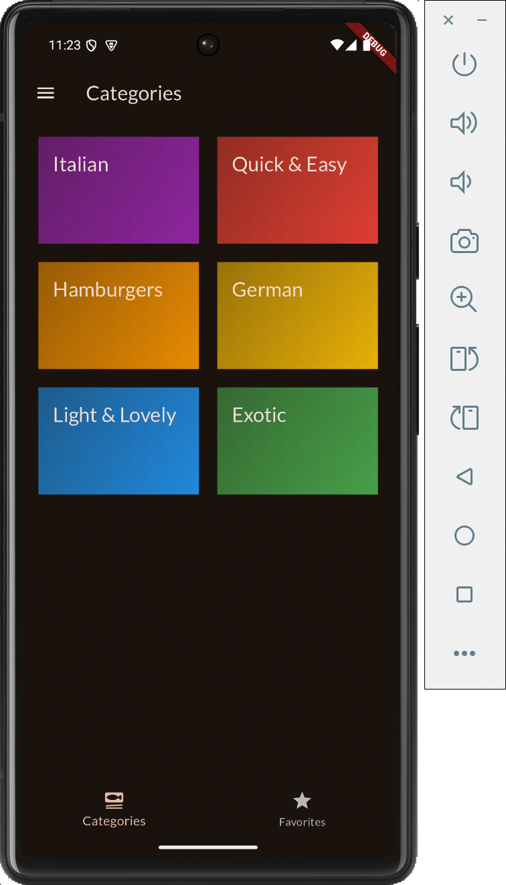
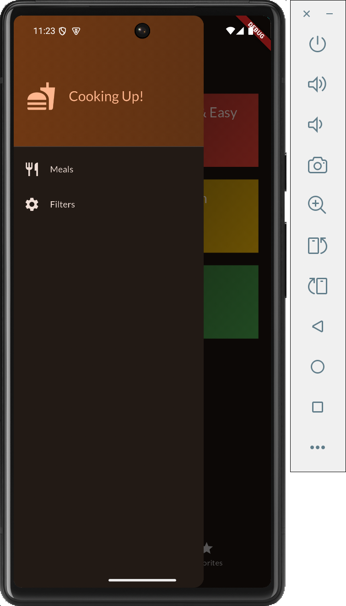
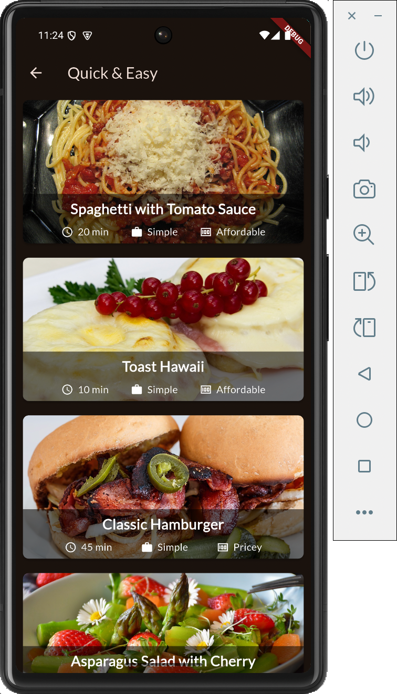
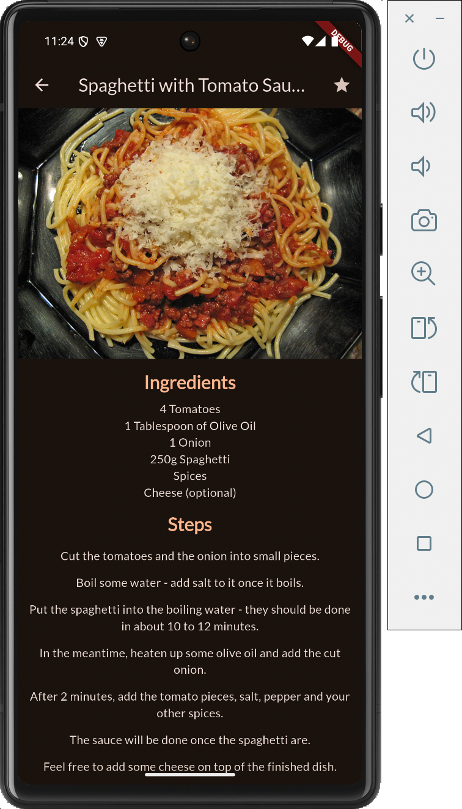

# Flutter Demo: Meals app

A very simple cookbook app which demonstrates building app with Flutter. Within these codes, you will see how to build widgets, create a bottom navigation bar and adding side drawer to the UI. You can also see the demonstration of using `Riverpod` for state management (see the provider package) accross different screens. It also shows how to create transistion animation between screens by adding `Tween` in the `PageRoute` object (see page_route Dart file) or using `Hero`.

## Getting Started

This codes are currently build for android only, so you should add support to different platforms by yourself using `flutter create`. Nevertheless the code should work on any platform with no issue.
I used Visual Studio Code to create this project, but could setup on your own to work with your favourite IDE/editor.
